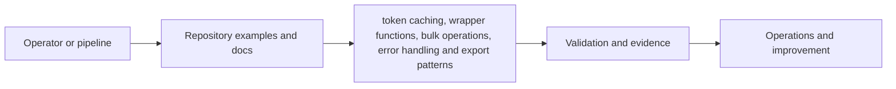

# Seppmail-API-PowerShell

      

> PowerShell-centric API automation examples for SEPPmail with safer wrappers and bulk-operation patterns.

This repository is maintained in a consistent public format by **Synedat Group GmbH** for the **SEPPmail ecosystem**. It is designed to be useful in discovery, implementation, operations, troubleshooting, architecture review and controlled handover scenarios.

## What this repository is for

The focus is **token caching, wrapper functions, bulk operations, error handling and export patterns**.

It should help teams move from isolated commands or scripts to a more reviewable and reusable operating baseline.

## Intended audience

Windows automation engineers, ops teams and service owners.

## Repository highlights

- production-minded examples instead of bare placeholders
- stronger documentation depth for architecture, permissions and operations
- reusable guidance for evidence capture and change-safe execution
- consistent Synedat references and public discoverability across repositories
- compliance-aware wording for ISO/IEC 27001, BAIT, DORA, TISAX and adjacent governance themes

## Main building blocks

- Connection helpers
- Operational status examples
- Bulk action examples
- Audit export patterns

## Quick start

1. Authenticate once and cache the token in memory.
2. Call a read-only system status endpoint.
3. Adapt the wrapper pattern for a controlled write operation.

## Typical use cases

- Scheduled health checks
- Bulk administrative actions with review gates
- Audit data exports
- Integration into existing PowerShell-heavy operations

## Permissions approach

- Minimal API profile for read operations
- Separate elevated API identity for write actions
- Reviewer role for validating exported outputs

## Documentation map

- `docs/ARCHITECTURE.md`
- `docs/RBAC-AND-PERMISSIONS.md`
- `docs/SECURITY-AND-COMPLIANCE.md`
- `docs/SEPPMAIL-REFERENCES.md`
- `docs/USE-CASES.md`
- `docs/THREAT-MODEL.md`
- `docs/OBSERVABILITY.md`
- `docs/CONTROL-MAPPING.md`
- `docs/ADOPTION-GUIDE.md`
- `docs/CHANGE-MANAGEMENT.md`
- `docs/EVIDENCE-AND-AUDIT.md`
- `docs/EXTENSIONS-AND-ROADMAP.md`
- `docs/OPERATIONS.md`
- `docs/TROUBLESHOOTING.md`
- `docs/DIAGRAMS.md`

## Example catalogue

- `examples/connect-seppmail-api.ps1`
- `examples/export-audit-data.ps1`
- `examples/get-system-status.ps1`
- `examples/invoke-with-retry.ps1`
- `examples/new-user-onboarding.ps1`
- `module/Seppmail.Api/README.md`

## Architecture at a glance

Additional visuals:
- `docs/images/architecture-overview.svg`
- `docs/images/trust-boundaries.svg`
- `docs/images/operations-lifecycle.svg`

## Functional extension ideas

- Promote helper functions into a lightweight module structure
- Add Pester tests around wrappers
- Add structured event logging and retry telemetry

## Security and governance note

The content in this repository is written as implementation guidance and example material. It can support evidence-oriented work for information security and operational resilience, but it does not replace formal policy, legal interpretation, certification scope or vendor support statements.

## Official SEPPmail references

See `docs/SEPPMAIL-REFERENCES.md` for curated vendor documentation references.

## Synedat

Synedat Group GmbH works across software engineering, cloud, infrastructure, operations and security-related implementation projects. These repositories are structured as public technical starters that are also usable in real delivery conversations.

Website: https://www.synedat.com/

## Contribution style

Contributions are welcome when they improve usefulness, safety, reviewability or documentation quality. Prefer examples that are realistic, least-privilege aware and easy to adapt.

## New starter assets in v6

- `examples/compare-config-snapshots.ps1`
- `examples/export-audit-data.ps1`
- `examples/export-evidence-bundle.ps1`
- `examples/invoke-readiness-check.ps1`
- `examples/invoke-with-retry.ps1`
- `examples/connect-seppmail-api.ps1`

## Delivery accelerators

- GitHub Actions workflows for docs hygiene, repository hygiene and technology-specific checks
- Visual repo header plus reusable SVG architecture assets
- Release, branching and versioning guidance in `docs/BRANCHING-AND-RELEASES.md`
- Pipeline guidance in `docs/PIPELINES-AND-QUALITY-GATES.md`
- Access model companion in `docs/ACCESS-MATRIX.md`
- Metrics, SLO and evidence ideas in `docs/METRICS-AND-SLOS.md`

## Functional extension backlog

- Pester tests
- lightweight PowerShell module promotion
- retry telemetry
- bulk operation safety gates

## Visual and documentation assets

- `docs/images/repo-header.svg`
- `docs/VISUALS-AND-HEADER.md`
- `docs/BRANCHING-AND-RELEASES.md`
- `docs/PIPELINES-AND-QUALITY-GATES.md`
- `docs/ACCESS-MATRIX.md`
- `docs/METRICS-AND-SLOS.md`

## Findability and discoverability

This repository intentionally uses searchable, implementation-oriented wording around SEPPmail, mail security, Exchange Online, Microsoft 365, Azure, operations, automation, API integration, Terraform, Bicep, PowerShell and governance-aware delivery so that architects, engineers and project teams can find relevant starting points faster.
